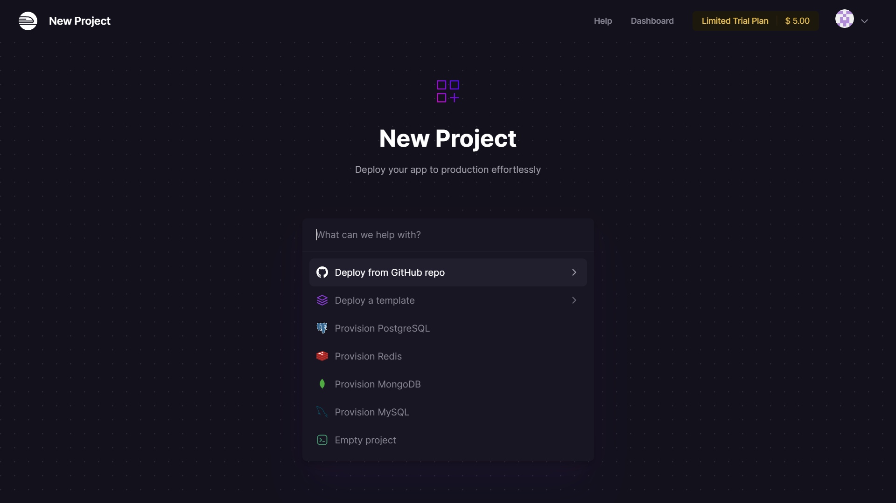
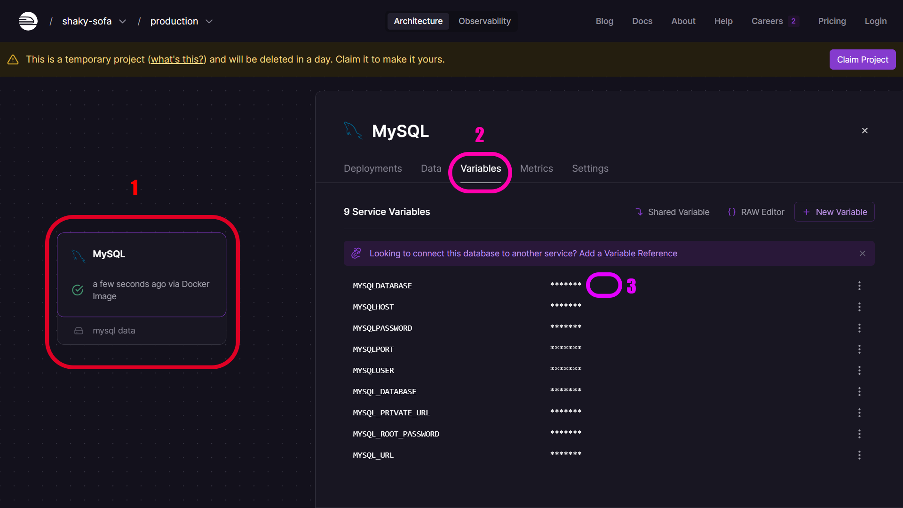
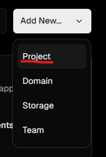
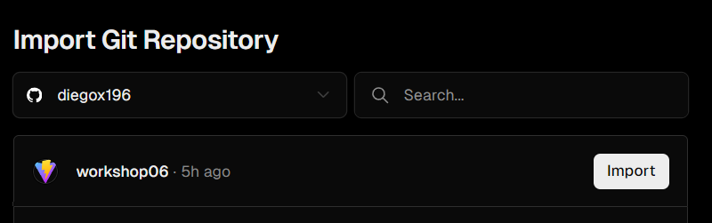
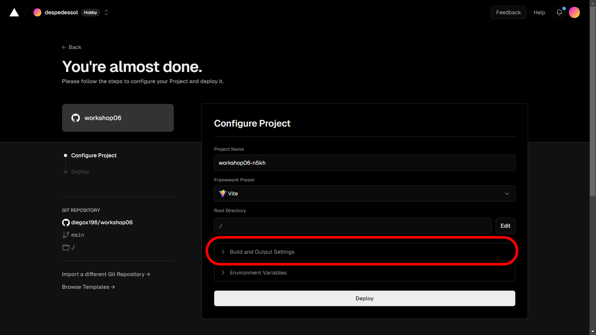
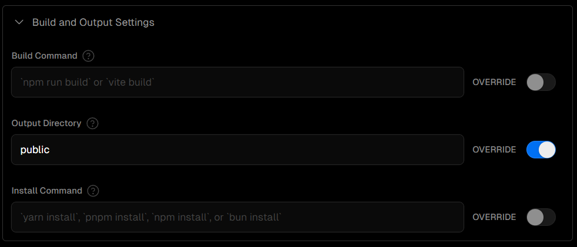
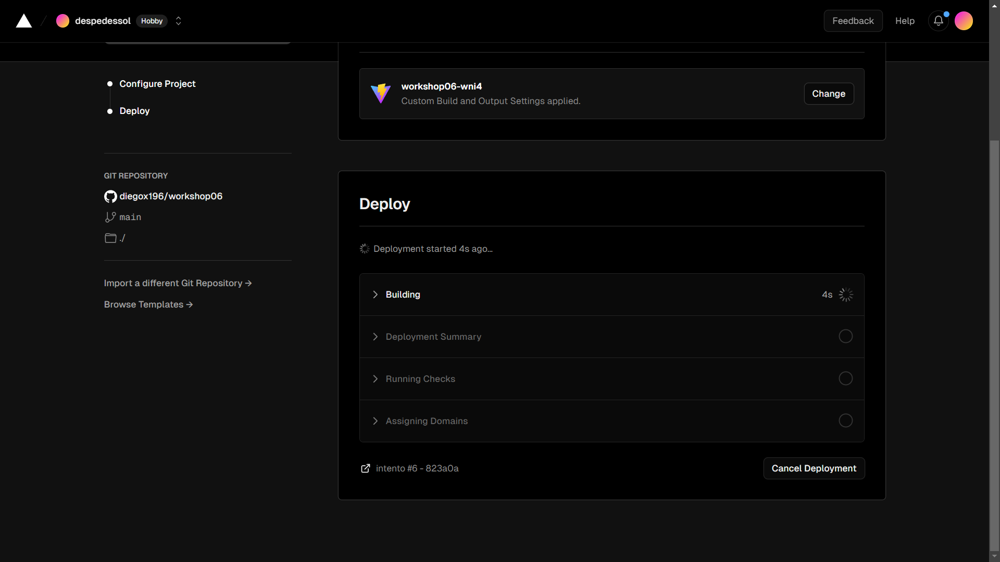
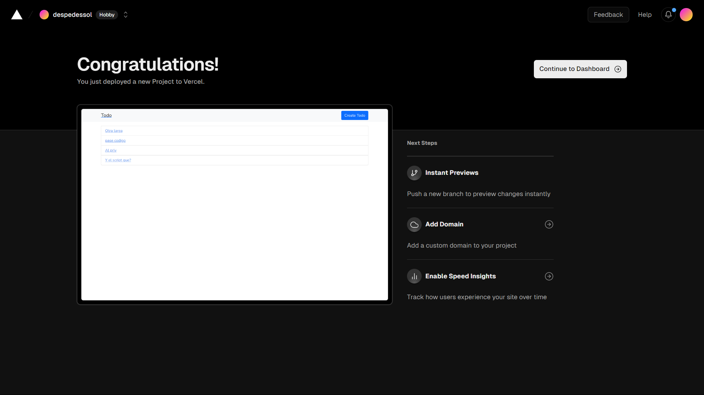

<p align="center"><a href="https://laravel.com" target="_blank"></a></p>

# Mini Hackathon

Pasos para desplegar una aplicación Laravel en PaaS

## Base de Datos

Para realizar este despliegue utilizaremos [Railway](https://railway.app/) Una vez dentro de la página, pulsaremos el botón que dice `Start a New Project`, lo que nos redirigirá a la siguiente pestaña.



Seleccionaremos la base de datos a utilizar, y esta se aprovisionará después de unos segundos o minutos.



Ahora, para realizar la conexión con la base de datos en nuestro proyecto Laravel, realizaremos los pasos mostrados anteriormente en la imagen para obtener los valores que deberemos agregar en el archivo `.env`.

## Aplicación Laravel

### Configuración necesaria en el proyecto

En nuestro proyecto local de Laravel, debemos realizar una configuración previa para poder usar Vercel.

- En la raiz de nuestro proyecto crearemos una carpeta llamada `api` y dentro de esta un archivo llamado `index.php` el cual llevara el siguiente codigo
  ``` php
    <?php

    // Forward Vercel requests to normal index.php
    require __DIR__ . '/../public/index.php';
  ```
- Ahora crear un archivo llamado `.vercelignore` en la raíz del proyecto el cual tendra el siguietne codigo
  ``` bash
    /vendor
  ```

- Por último continuando en la carpeta raíz del proyecto, crearemos un archivo llamado `vercel.json` en el que agregaremos  la siguiente configuración, completando los datos faltantes con las variables de entorno de su proyecto:
  ``` json
  {
    "version": 2,
      "framework": null,
      "functions": {
        "api/index.php": { "runtime": "vercel-php@0.6.0" }
    },
    "routes": [{
        "src": "/(.*)",
        "dest": "/api/index.php"
    }],
    "env": {
        "APP_ENV": "production",
        "APP_DEBUG": "true",
        "APP_NAME":"Laravel",
        "APP_KEY":"",
  
        "DB_CONNECTION":"",
        "DB_HOST":"",
        "DB_PORT":"",
        "DB_DATABASE":"",
        "DB_USERNAME":"",
        "DB_PASSWORD":"",
  
        "APP_CONFIG_CACHE": "/tmp/config.php",
        "APP_EVENTS_CACHE": "/tmp/events.php",
        "APP_PACKAGES_CACHE": "/tmp/packages.php",
        "APP_ROUTES_CACHE": "/tmp/routes.php",
        "APP_SERVICES_CACHE": "/tmp/services.php",
        "VIEW_COMPILED_PATH": "/tmp",
  
        "CACHE_DRIVER": "array",
        "LOG_CHANNEL": "stderr",
        "SESSION_DRIVER": "cookie"
    }
  }
  ```

### Crear el repositorio para el proyecto
[Vercel](https://vercel.com/login) permite desplegar los proyectos que se encuentren creados con la cuenta que realizamos el inicio de sesión, por lo cual deberemos subir el proyecto con todos las configuraciones realizadas anteriormente en dicho git.

### Despliegue en vercel
Una vez realizado el paso anterior, podemos continuar con la publicación de nuestra aplicación Laravel. En [Vercel](https://vercel.com/login) iniciaremos sesión con la cuenta de `GitLab`, `GitHub` o `Bitbucket` en la que se encuentra el repositorio con el proyecto de laravel.

Cuando realizamos lo anterior nos llevará al [Dashboard de Vercel](https://vercel.com/dashboard). En este, pulsaremos el botón de `Add New` y luego `Project`.



Luego nos llevará a un panel en el cual buscaremos nuestro proyecto y pulsaremos `Import`.



Lo anterior nos llevará a la siguiente pantalla, en la cual pulsaremos sobre el menú resaltado en la imagen.



En este menú, deberemos habilitar la sobreescritura de `Output Directory` y agregaremos el siguiente valor `public`, quedando de la siguiente manera.



Para finalizar, solo queda pulsar el botón `Deploy` y esperar a que el proyecto se despliegue. Esto puede tomar unos segundos.



Al terminar ese proceso, se nos mostrará la siguiente pantalla.

